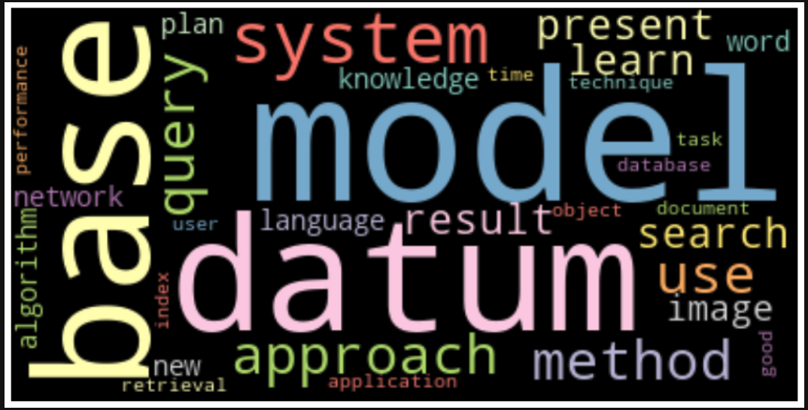

## Topic analysis (ML and AI in academia)

<figure class="image">
    
    <figcaption></figcaption>
</figure>

1. Find the best/popular paper of top conferences in ML and AI;
2. Use web scraping to get the abstracts for those papers;
3. Use LDA (topic model) to analyze the paper abstract; extract the topics and their associated words;
4. Do some further analyses to mine more useful and interesting results. For example:
    * What are the trends of research interests over the last decade;

## Project Structure
    ├── data
    ├── scripts
    └── notebooks